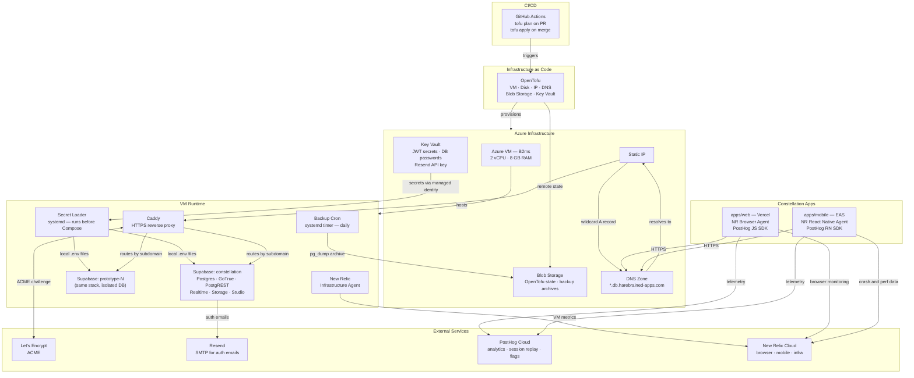
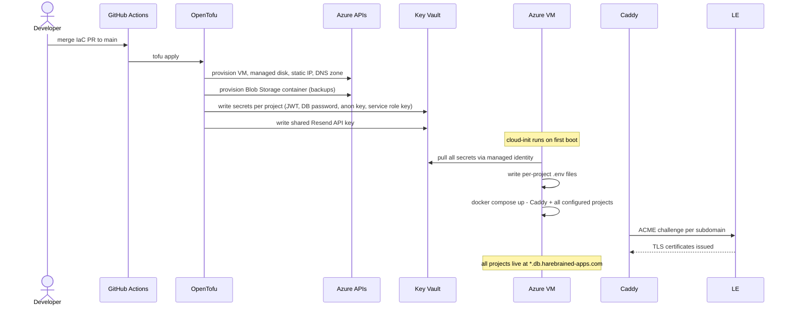
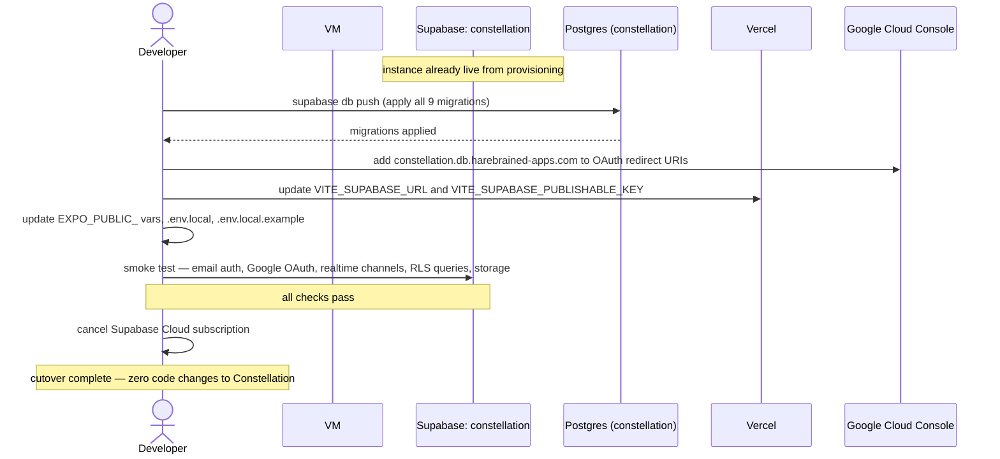
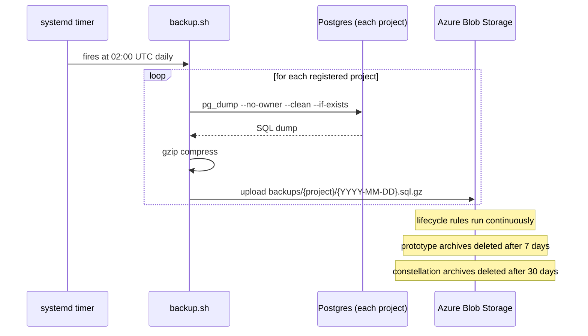
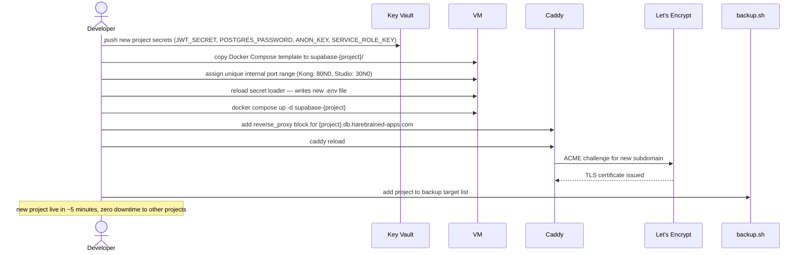

# Architecture: Self-Hosted Supabase on Azure

**Bead**: co-kkd
**Status**: Revised
**Created**: 2026-04-10
**Architect**: constellation/architect

---

## Architecture Overview

A single Azure VM (B2ms) hosts multiple independent Supabase deployments as Docker Compose projects, fronted by a Caddy reverse proxy that provides automatic HTTPS and subdomain routing. All Azure resources are provisioned by OpenTofu (remote state in Azure Blob Storage); all secrets are stored in Azure Key Vault and pulled at VM startup via managed identity — nothing sensitive lives in Docker Compose files or CI. A systemd-scheduled backup script runs daily `pg_dump` per project and archives compressed dumps to Azure Blob Storage, with per-project retention enforced by Azure lifecycle rules. Resend provides SMTP for Supabase auth emails. Observability is layered: a New Relic Infrastructure Agent covers VM health; New Relic Browser and React Native agents cover `apps/web` and `apps/mobile` respectively; PostHog JS and React Native SDKs provide product analytics, session replay, and feature flags in both apps. This architecture follows the gasworks target stack with no deviations.

---

## System Diagram

---

## Components

- **OpenTofu Modules**: Provisions all Azure resources declaratively. Remote state stored in a pre-bootstrapped Azure Blob Storage container (`tfstate`). GitHub Actions runs `tofu plan` on PR and `tofu apply` on merge to main. No manual portal provisioning.

- **Azure VM (B2ms)**: Compute host for all Supabase instances. 2 vCPU / 8 GB RAM — adequate for 3–5 concurrent projects. Has an Azure Managed Identity with read access to Key Vault. Online resize to B4ms when approaching capacity (no data loss, minutes of downtime).

- **Azure Key Vault**: Single source of truth for all runtime secrets — per-project JWT secrets, Postgres passwords, anon/service-role keys, and the shared Resend API key. The VM's managed identity grants read access. No secrets appear in Docker Compose files, `.env` files committed to git, or CI environment variables.

- **Secret Loader (systemd)**: A systemd service unit that runs before Docker Compose on every VM start. Uses `az keyvault secret show` (managed identity, no credentials needed) to populate per-project `.env` files that Docker Compose reads via `env_file`. This is the only path by which secrets enter the runtime environment.

- **Caddy**: Reverse proxy running on the VM. Listens on 80/443. Routes incoming subdomains (`constellation.db.harebrained-apps.com`, `proto-b.db.harebrained-apps.com`, etc.) to the correct Supabase project's Kong API Gateway port. Handles HTTPS automatically via Let's Encrypt ACME — no manual certificate management. Studio subdomains are also routed for developer access.

- **Supabase Stack (per project)**: Each project is an independent Docker Compose deployment using the official Supabase self-hosting config: Kong API Gateway, Postgres, GoTrue (auth), PostgREST, Realtime, Storage API, and Studio. Projects run on non-overlapping internal port ranges; only Caddy needs to know each project's port. Each project has its own isolated Postgres database and Docker volume set — projects cannot affect each other.

- **Azure Blob Storage**: Dual-purpose. Container `tfstate`: OpenTofu remote state backend (pre-bootstrapped before first `tofu apply`). Container `backups`: daily `pg_dump` archives per project. Azure lifecycle rules enforce retention (7 days for prototypes, 30 days for Constellation production).

- **Backup Cron (systemd timer)**: A systemd timer fires daily (e.g., 02:00 UTC). The associated script iterates over all registered projects, runs `pg_dump --no-owner --clean`, gzip-compresses the output, and uploads to `backups/{project}/{YYYY-MM-DD}.sql.gz` in Blob Storage. Uses the Azure CLI (authenticated via VM managed identity) for uploads — no storage credentials needed.

- **Azure DNS Zone**: Hosts a wildcard A record (`*.db.harebrained-apps.com`) pointing to the VM's static IP. New Supabase projects are available immediately via their subdomain once Caddy is configured — no DNS changes needed per project.

- **Resend SMTP**: External transactional email provider. Required by Supabase's GoTrue auth service for email verification, password reset, and magic links. API key stored in Key Vault. GoTrue in each Supabase project is configured to use Resend's SMTP endpoint. Free tier (3,000 emails/month) covers all pre-launch needs.

- **New Relic Infrastructure Agent**: Installed on the VM. Provides CPU, memory, disk, and process-level health metrics. Alerts on disk > 80% capacity (the most likely capacity constraint). Reports to New Relic Cloud. No application code changes.

- **New Relic Browser Agent** (`apps/web`): `@newrelic/browser-agent` npm package initialized in `apps/web/src/main.tsx`. Captures page load performance, Core Web Vitals, JS errors, and AJAX/fetch request timing. SDK install only — no backend changes.

- **New Relic React Native Agent** (`apps/mobile`): `@newrelic/newrelic-react-native-agent` installed in `apps/mobile`. Compatible with Expo managed workflow (no native module ejection required). Captures JS errors, crashes, network request timing, and app launch time. SDK install only — no backend changes.

- **PostHog** (`apps/web` + `apps/mobile`): Product analytics, session replay, and feature flags. Web: `posthog-js` SDK initialized in `apps/web/src/main.tsx` with autocapture enabled on day 1 (captures clicks, pageviews, form submissions without manual instrumentation). Mobile: `posthog-react-native` SDK initialized in `apps/mobile`. In both apps, `posthog.identify(userId, { email })` is called immediately after successful auth — this is the key integration point with Supabase auth. Feature flags available from day 1 for controlled rollouts. Free tier: 1M events/month, 5K session recordings/month, 1M flag requests/month — covers pre-launch at $0.

---

## Key Flows

### Flow 1: Infrastructure Provisioning (first `tofu apply`)

Secrets never leave Key Vault as environment variables in CI — OpenTofu writes them to Key Vault, and the VM reads them at runtime via managed identity. GitHub Actions has no access to Supabase credentials.

---

### Flow 2: Constellation Cutover (one-time migration)

DNS propagation is not a concern because the URL is being changed (not DNS being flipped) — Vercel env var update is instant. Mobile env vars require a new EAS build/OTA update.

---

### Flow 3: Daily Backup

Restore procedure: download `.sql.gz` from Blob, gunzip, `psql` into a clean Postgres instance. Must be documented and tested in Phase 3 before cutover.

---

### Flow 4: Adding a New Supabase Project

Each new project is fully isolated. Crashing or misconfiguring one project has no effect on others.

---

## Data Model

> Omitted. This system manages infrastructure, not application data. There is no persistent schema introduced by this architecture.

---

## Constraints & SLOs

- **Availability**: ~99.9% (Azure B2ms SLA — approximately 8.7 hours downtime/year). Acceptable for pre-launch production. Single VM is the failure domain; no HA required at this stage. Add replication or failover when Constellation has paying users.

- **Latency**: N/A — this architecture sets up infrastructure, not a latency-sensitive service. Supabase API latency is identical to Supabase Cloud; no new latency introduced.

- **Scale**: B2ms (2 vCPU / 8 GB RAM) supports 3–5 concurrent Supabase projects. Online resize to B4ms when approaching 4+ active projects (takes minutes, no data loss). 64 GB SSD covers early stage; New Relic alerts at 80% disk capacity.

- **Security**:
  - All secrets in Azure Key Vault; accessed only via VM managed identity at runtime
  - No secrets in Docker Compose YAML, committed `.env` files, or CI environment variables
  - Postgres ports internal to Docker networks — not exposed on VM host interface
  - Caddy enforces HTTPS for all external traffic; HTTP redirects to HTTPS
  - Supabase Studio subdomains accessible only via HTTPS; access controls via Supabase auth

- **Cost**: ~$44–50/month total from Azure credits — $0 out-of-pocket. Breakdown: B2ms VM (~$35), managed disk 64 GB (~$5), static IP (~$3), DNS zone (~$1), Blob Storage (~$1–2), Key Vault (~$0). Resend free tier (3,000 emails/month). New Relic free tier (100 GB/month ingest, covers infra + browser + mobile). PostHog free tier (1M events/month, 5K session recordings, 1M flag requests).

- **API Docs**: No new APIs introduced. Supabase self-hosted exposes the same REST/Realtime/Auth/Storage API surface as Supabase Cloud — no OpenAPI documentation changes required for Constellation or any other application.

- **Backup SLOs**: Constellation — 30-day retention, daily cadence. Prototypes — 7-day retention, daily cadence. Restore from backup must be tested in Phase 3 before cutover proceeds.

---

## Open Questions

None. All four PRD decisions are resolved:

- **VM size**: B2ms (~$44/month). Resize to B4ms online if needed.
- **Cutover sequence**: Migrate Constellation directly (pre-launch, no real users, downtime acceptable).
- **Staging**: Local Supabase CLI for now; add VM staging instance when Constellation has real users.
- **Backup retention**: 30 days for Constellation production, 7 days for prototypes.
