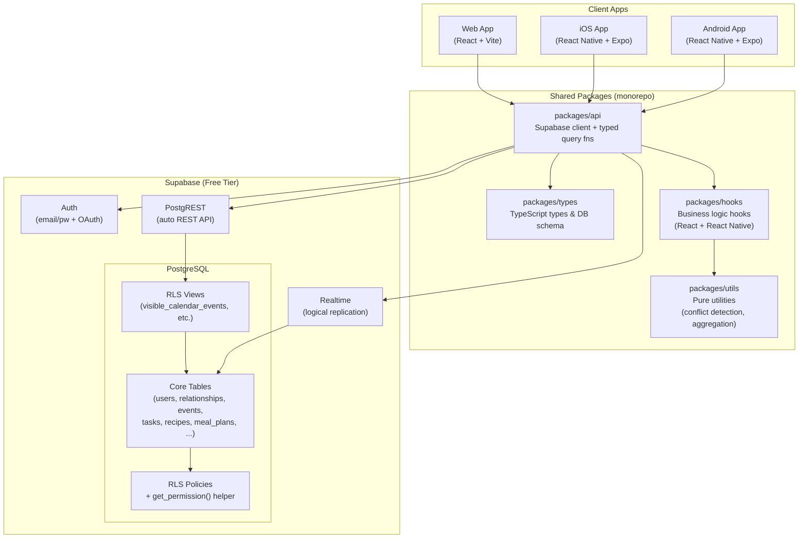
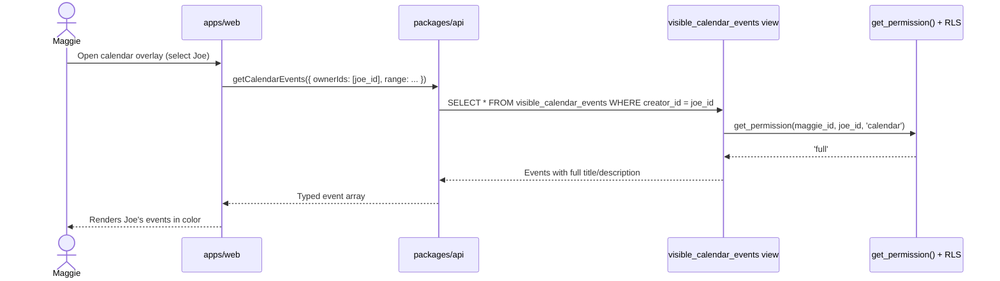
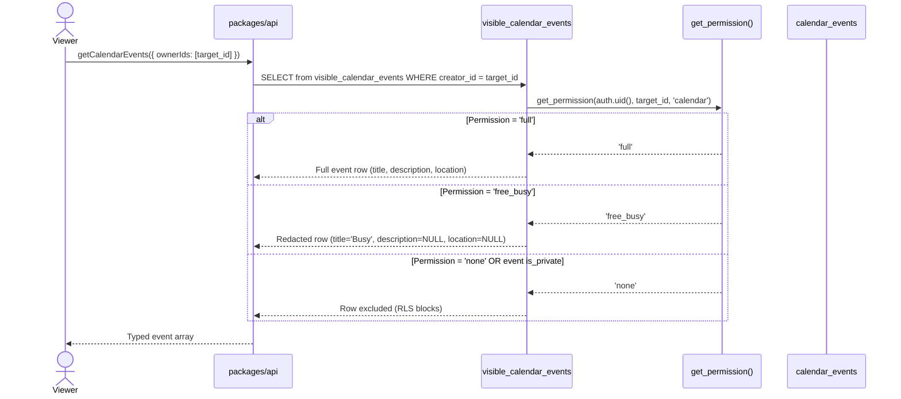
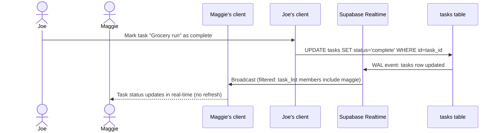
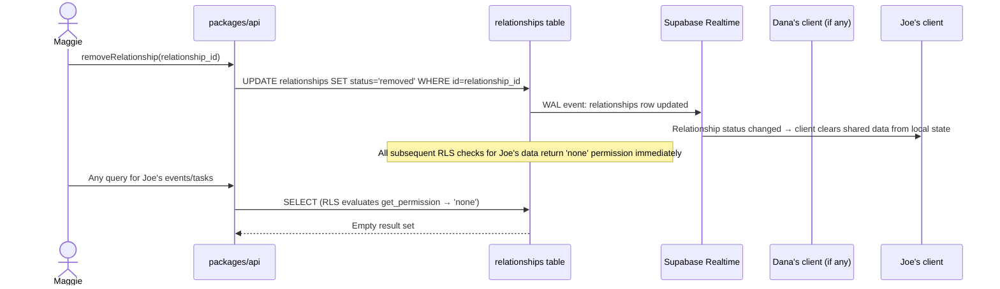
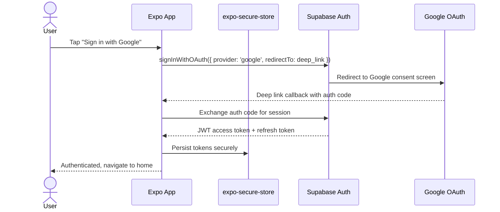
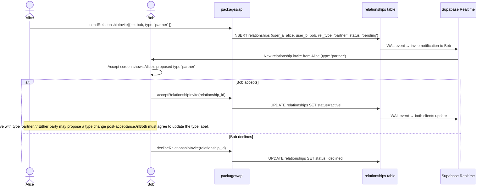
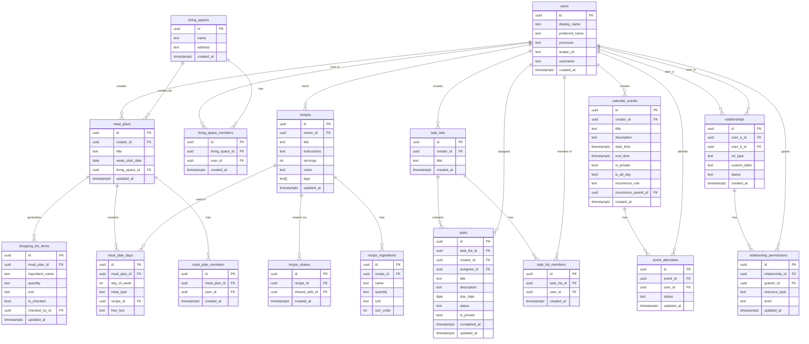

# Architecture: Constellation App — Polyamorous Relationship Coordination Platform

**Bead**: co-wisp-jk2
**Status**: Revised (all open questions resolved)
**Created**: 2026-04-08
**Architect**: constellation/architect

---

## Architecture Overview

Constellation is a cross-platform coordination app (React web + React Native iOS/Android) backed by Supabase (PostgreSQL + Realtime + Auth). The system is structured as a Turborepo monorepo with a shared `packages/` layer (TypeScript types, API client, business logic hooks, utilities) and platform-specific `apps/` (web, mobile). All data access flows through Row-Level Security policies enforced at the Supabase/PostgREST layer, with a `SECURITY DEFINER` permission helper function resolving the Full/Free-Busy/None model for every resource query. Real-time sync uses Supabase Realtime channels with per-user filtered subscriptions to stay within free-tier connection limits. No custom backend server is required for MVP.

---

## System Diagram



---

## Components

- **apps/web**: React + Vite SPA. Uses `react-force-graph` (WebGL/Canvas) for constellation graph. React Router for navigation. Tailwind CSS for styling.
- **apps/mobile**: Expo-managed React Native app. Uses D3-force (layout) + `react-native-svg` (rendering) for constellation graph. Expo Router for navigation. `expo-secure-store` for token storage.
- **packages/types**: Auto-generated TypeScript types from Supabase schema (`supabase gen types`). Single source of truth for all table and API types.
- **packages/api**: Supabase JS client instance + typed query functions for every data operation. Handles all PostgREST calls. No business logic — pure data access.
- **packages/hooks**: React hooks wrapping `packages/api` with local state, optimistic updates, and Realtime subscription setup. Usable in both React and React Native.
- **packages/utils**: Pure JavaScript utilities with no platform dependencies — conflict detection algorithm, shopping list ingredient aggregation, graph topology analysis (polycule cluster detection), date helpers.
- **Supabase Auth**: Issues JWTs. Handles email/password, OAuth (Google). Session management delegated entirely to `@supabase/supabase-js`.
- **PostgREST**: Auto-generates REST endpoints from the PostgreSQL schema. All read queries go through RLS-protected views that apply the Full/Free-Busy/None masking.
- **Supabase Realtime**: Broadcasts row-level change events from PostgreSQL logical replication. Clients subscribe with per-user filters to minimize connections.
- **RLS Policies + `get_permission()` helper**: A `SECURITY DEFINER` function that resolves the effective permission level (full / free_busy / none) between any two users for any resource type. All RLS `SELECT` policies call this function. This is the security boundary — all privacy guarantees depend on it.

---

## Key Flows

### Happy Path: Calendar Overlay (Maggie views Joe's events)



Maggie sees Joe's events because she has Full calendar permission. The `visible_calendar_events` view applies field masking inline — if permission were `free_busy`, the view would return `title = 'Busy'` and `description = NULL` for Joe's events.

---

### Permission-Gated Free/Busy Rendering



Private events (`is_private = true`) are always excluded from other users' queries regardless of permission level — this is enforced both in RLS and in the view's `CASE` expressions.

---

### Real-Time Task Update Propagation



Each client subscribes to a Realtime channel filtered to their user ID on join. The subscription filter `task_list_members.user_id = auth.uid()` ensures Maggie only receives updates for task lists she's a member of.

---

### Relationship Removal (Immediate Access Revocation)



Because RLS is evaluated at query time and calls `get_permission()` which reads the current `relationships.status`, access revocation is instantaneous — no cache invalidation needed.

---

### OAuth Auth Flow (Mobile)



The Expo app uses `expo-auth-session` with Supabase's PKCE flow. `expo-secure-store` replaces the default `localStorage` adapter for token persistence on mobile.

---

### Relationship Invite Accept Flow



Bob accepts using Alice's proposed type label — there is no counter-proposal UI at invite time. After the relationship is active, either party can initiate a type change through the relationship settings screen; both must agree before the type label updates. The accept screen is intentionally simple: display the proposed type, offer Accept or Decline only.

---

## Data Model



---

## RLS Policy Design

This is the highest-risk component. The `get_permission()` function is the security boundary for all privacy guarantees.

### Permission resolution function

```sql
-- Returns 'full', 'free_busy', or 'none'
-- viewer_id: the auth.uid() making the query
-- owner_id: the user whose data is being accessed
-- resource: 'calendar', 'tasks', or 'meals'
CREATE OR REPLACE FUNCTION get_permission(
    viewer_id uuid,
    owner_id uuid,
    resource text
) RETURNS text
LANGUAGE sql STABLE SECURITY DEFINER AS $$
    SELECT COALESCE(
        -- Explicit permission grant (most specific wins)
        (
            SELECT rp.level
            FROM relationship_permissions rp
            JOIN relationships r ON rp.relationship_id = r.id
            WHERE rp.grantor_id = owner_id
              AND rp.resource_type = resource
              AND r.status = 'active'
              AND (
                (r.user_a_id = owner_id AND r.user_b_id = viewer_id) OR
                (r.user_b_id = owner_id AND r.user_a_id = viewer_id)
              )
            LIMIT 1
        ),
        -- Default: active relationship → 'free_busy', no relationship → 'none'
        CASE WHEN EXISTS (
            SELECT 1 FROM relationships r
            WHERE r.status = 'active'
              AND (
                (r.user_a_id = owner_id AND r.user_b_id = viewer_id) OR
                (r.user_b_id = owner_id AND r.user_a_id = viewer_id)
              )
        ) THEN 'free_busy' ELSE 'none' END
    );
$$;
```

### Calendar events view (field masking)

```sql
CREATE OR REPLACE VIEW visible_calendar_events AS
SELECT
    id,
    creator_id,
    start_time,
    end_time,
    is_all_day,
    recurrence_rule,
    recurrence_parent_id,
    created_at,
    -- Field masking based on permission level
    CASE
        WHEN creator_id = auth.uid() THEN title
        WHEN is_private THEN 'Busy'
        WHEN get_permission(auth.uid(), creator_id, 'calendar') = 'full' THEN title
        ELSE 'Busy'
    END AS title,
    CASE
        WHEN creator_id = auth.uid() THEN description
        WHEN is_private THEN NULL
        WHEN get_permission(auth.uid(), creator_id, 'calendar') = 'full' THEN description
        ELSE NULL
    END AS description,
    CASE
        WHEN creator_id = auth.uid() THEN location
        WHEN is_private THEN NULL
        WHEN get_permission(auth.uid(), creator_id, 'calendar') = 'full' THEN location
        ELSE NULL
    END AS location,
    -- Expose permission level so client knows how to render
    CASE
        WHEN creator_id = auth.uid() THEN 'full'
        WHEN is_private THEN 'none'
        ELSE get_permission(auth.uid(), creator_id, 'calendar')
    END AS viewer_permission
FROM calendar_events
WHERE
    -- Own events
    creator_id = auth.uid()
    -- Attendee
    OR id IN (
        SELECT event_id FROM event_attendees WHERE user_id = auth.uid()
    )
    -- Permission-gated (Full or Free/Busy, non-private)
    OR (
        NOT is_private
        AND get_permission(auth.uid(), creator_id, 'calendar') IN ('full', 'free_busy')
    );
```

### Sample RLS policies for other tables

```sql
-- Tasks: visible if member of the task list, or assigned, or creator
ALTER TABLE tasks ENABLE ROW LEVEL SECURITY;

CREATE POLICY "tasks_select" ON tasks FOR SELECT USING (
    creator_id = auth.uid()
    OR assignee_id = auth.uid()
    OR task_list_id IN (
        SELECT task_list_id FROM task_list_members WHERE user_id = auth.uid()
    )
    OR (
        NOT is_private
        AND task_list_id IN (
            SELECT tl.id FROM task_lists tl
            WHERE get_permission(auth.uid(), tl.creator_id, 'tasks') IN ('full', 'free_busy')
        )
    )
);

-- Relationships: visible only to the two parties
ALTER TABLE relationships ENABLE ROW LEVEL SECURITY;

CREATE POLICY "relationships_select" ON relationships FOR SELECT USING (
    user_a_id = auth.uid() OR user_b_id = auth.uid()
);
```

---

## Real-Time Sync Architecture

### Channel strategy (free tier: 500 concurrent connections)

Each authenticated client opens **one Realtime connection** with multiple subscriptions multiplexed on it. Supabase JS client handles this transparently.

```
User's single Realtime connection
├── channel: "user:{uid}" (personal data)
│   ├── postgres_changes: tasks WHERE assignee_id = uid
│   ├── postgres_changes: event_attendees WHERE user_id = uid
│   └── postgres_changes: relationships WHERE user_a_id = uid OR user_b_id = uid
└── channel: "shared:{uid}" (data user participates in)
    ├── postgres_changes: tasks WHERE task_list_id IN (my task lists)
    ├── postgres_changes: meal_plan_days WHERE meal_plan_id IN (my meal plans)
    └── postgres_changes: shopping_list_items WHERE meal_plan_id IN (my meal plans)
```

Free tier limit: 500 concurrent connections. At MVP scale this is not a concern. Document that connection pooling via PgBouncer (available on paid tier) is the scaling path when needed.

### Optimistic updates

Hooks in `packages/hooks` apply optimistic updates before the Supabase write resolves, then reconcile on the Realtime event. This gives sub-100ms perceived latency for task status changes and RSVP updates.

---

## Graph Rendering Approach

### Web: `react-force-graph` (ForceGraph2D)

- WebGL canvas rendering via three.js — handles 50+ nodes smoothly
- Built-in force-directed layout
- Supports custom node/link rendering for color-coded persons
- Bundle: ~200KB gzipped (acceptable)

### Mobile: D3-force + react-native-svg

D3's `d3-force` module is pure JavaScript with no DOM dependency — it runs in React Native. Strategy:

1. Run force simulation in a `useEffect` to compute node positions
2. Render positions using `react-native-svg` `<Circle>` and `<Line>` elements
3. Add gesture handling with `react-native-gesture-handler` for pinch-to-zoom and pan

This avoids any native module dependency and is fully Expo-compatible (no ejection required).

### Polycule cluster detection (`packages/utils`)

Clusters emerge from graph topology via connected components analysis:

```typescript
// Identify polycule clusters using union-find on the direct relationship graph
function detectPolyclueClusters(
  nodes: User[],
  edges: Relationship[]
): Map<string, string[]> { ... }
```

Metamour nodes (visible ones) are rendered as smaller, dimmed nodes outside cluster hulls.

---

## Monorepo Structure

**Recommendation: Turborepo monorepo** (single repository)

Rationale: sharing TypeScript types and business logic hooks between React and React Native requires a monorepo. A single `supabase gen types` command keeps all packages in sync. Atomic cross-platform changes are a significant operational advantage when every feature ships to both platforms simultaneously.

```
constellation/
├── turbo.json
├── package.json              # root workspace
├── supabase/
│   ├── migrations/           # SQL migration files
│   └── seed.sql
├── packages/
│   ├── types/                # supabase gen types output + hand-written types
│   ├── api/                  # Supabase client + typed query functions
│   ├── hooks/                # React/RN hooks (useCalendar, useTasks, useGraph, ...)
│   └── utils/                # Pure utilities (conflict detection, aggregation, clusters)
└── apps/
    ├── web/                  # React + Vite + Tailwind + react-force-graph
    └── mobile/               # Expo + React Native + expo-router + d3-force + rn-svg
```

CI builds: `turbo build` runs web build + mobile EAS build in parallel. Type-checking runs across all packages simultaneously.

**RLS safety CI gate**: A custom lint/CI step scans all files in `packages/api` and `apps/` for direct queries against `calendar_events` (and equivalent sensitive tables) that bypass the RLS views. Any direct `FROM calendar_events` reference outside of migration files fails the build. This prevents accidental bypassing of the field-masking views.

**Supabase environments**: Single Supabase project using [Supabase environment branching](https://supabase.com/docs/guides/deployment/managing-environments) for dev/staging/prod isolation. Free tier is limited to 3 projects total — separate projects per environment would exhaust that budget. Environment branching is the correct approach: migrations are applied per branch, and each branch gets its own API URL and anon key.

---

## Auth Flow Design

### Session storage by platform

| Platform | Token storage | Adapter |
|---|---|---|
| Web | `localStorage` (Supabase default) | None needed |
| iOS/Android | `expo-secure-store` | Custom `AsyncStorage`-compatible adapter |

### OAuth on mobile (PKCE flow)

```
1. App calls supabase.auth.signInWithOAuth({ provider: 'google', redirectTo: APP_SCHEME://auth/callback })
2. expo-web-browser opens Google consent in in-app browser
3. Google redirects to APP_SCHEME://auth/callback?code=...
4. Expo deep link handler catches callback
5. App calls supabase.auth.exchangeCodeForSession(code)
6. Tokens stored in SecureStore via custom adapter
```

### Session management

- `supabase.auth.onAuthStateChange` listener in root component handles session refresh
- JWT expiry: Supabase default 1 hour, auto-refreshed by SDK
- Logout: `supabase.auth.signOut()` + clear SecureStore + navigate to login

---

## Implementation Phasing

### Phase 1 — Foundation (prerequisite for everything)
- Supabase project creation, database migrations, RLS policies
- `get_permission()` function + security review
- `visible_calendar_events` view and equivalent views for tasks/meals
- Monorepo scaffold: Turborepo + all `packages/` stubs + both `apps/`
- CI/CD: GitHub Actions → Vercel (web) + EAS Build (mobile)
- Shared design tokens and base theme

### Phase 2 — Auth & Profiles
- Email/password sign up + login (web + mobile)
- Google OAuth (web + mobile, PKCE on mobile)
- User profile create/edit (name, preferred name, pronouns, avatar)
- `packages/hooks`: `useAuth`, `useProfile`

### Phase 3 — Relationship Graph
- Relationship data model + all RLS policies
- Invite flow (by email/username), accept/decline
- Relationship list + permission settings editor
- Constellation view: graph visualization (web: ForceGraph2D, mobile: d3-force + rn-svg)
- Color assignment per person (persisted, propagated across app)
- `packages/utils`: `detectPolyclueClusters`
- `packages/hooks`: `useRelationships`, `useConstellationGraph`

### Gate: RLS Security Review (before Phase 4 begins)
**Reviewer**: Steve Bargelt (overseer). Review must cover: `get_permission()` function correctness for all edge cases (removed relationships, private events, metamour visibility), all RLS `SELECT`/`INSERT`/`UPDATE`/`DELETE` policies, and the `visible_calendar_events` field-masking view. The CI gate (direct `calendar_events` table query scanner) must be passing before this review begins. Phase 4 is blocked until this review is signed off.

### Phase 4 — Calendar
- Calendar data model + RLS + `visible_calendar_events` view
- Create/edit/delete events (personal calendar)
- Recurring event support (RRULE)
- Invite direct partners to events, RSVP
- Overlay calendar view (multi-person, color-coded)
- Free/Busy rendering for permission-gated calendars
- Private event handling
- Conflict detection on event creation (`packages/utils`: `detectConflicts`)
- Real-time sync (Supabase Realtime channels)
- Calendar UI: month/week/day views (web + mobile)
- `packages/hooks`: `useCalendar`, `useCalendarOverlay`

### Phase 5 — Tasks
- Task lists + tasks data model + RLS
- Create/edit task lists, share with direct partners
- Create/edit tasks, assign to self or direct partner
- Task status transitions
- Task history view
- Real-time sync
- `packages/hooks`: `useTasks`, `useTaskLists`

### Phase 6 — Recipes & Meal Planning
- Recipe + ingredient data model + RLS
- Personal recipe library (create/edit/delete)
- Share recipe with direct partner
- Meal plan data model + RLS
- Create/edit weekly meal plan
- Shopping list generation (`packages/utils`: `aggregateIngredients`)
- Real-time shopping list sync (collaborative check-off)
- `packages/hooks`: `useRecipes`, `useMealPlan`, `useShoppingList`

### Phase 7 — Living Spaces
- Living space data model + RLS
- Create/edit/delete living spaces
- Associate self and direct partners with spaces
- Wire up living space context to meal plan UI

---

## Constraints & SLOs

- **Availability**: Supabase free tier SLA — best-effort, no formal guarantee. Acceptable for MVP.
- **Latency**: Real-time task/calendar updates ≤ 1 second (Supabase Realtime target per PRD acceptance criteria). Calendar overlay load ≤ 2 seconds.
- **Scale**: Supabase free tier: 500 concurrent Realtime connections, 2M messages/month, 500MB database. Sufficient for MVP/beta. Document paid-tier migration path.
- **Security**: All data access gated by RLS + `get_permission()`. No data readable without `auth.uid()` in JWT. Privacy bugs in `get_permission()` are P0. Pre-launch security review of all RLS policies required.
- **Cost**: Free tier only. No paid Supabase features, no monetization infrastructure.
- **API Docs**: The primary API surface is Supabase PostgREST (auto-documented via OpenAPI at `{SUPABASE_URL}/rest/v1/?apikey={KEY}`). The `packages/api` typed query layer serves as the human-facing API contract — it must be 100% covered by TypeScript types from `packages/types`. No additional OpenAPI spec authoring required for MVP (PostgREST generates it automatically). If a custom Edge Function is introduced in a future phase, it must include OpenAPI documentation.

---

## Resolved Decisions

All architectural open questions are now resolved. Decisions documented below for traceability.

**D-A: RLS security review** — Reviewer: Steve Bargelt. Blocking gate before Phase 4 ships. CI gate added to flag direct `calendar_events` table queries that bypass the view. Documented as a named phase gate in Implementation Phasing.

**D-B: Relationship type mismatch on invite** — Bob accepts using Alice's proposed type. No counter-proposal or negotiation UI at invite time. Accept screen shows the proposed type; options are Accept or Decline only. Post-acceptance type changes require both parties to agree via relationship settings. See Invite Accept Flow diagram above.

**D-C: Supabase project structure** — Single Supabase project with environment branching (dev/staging/prod). Free tier limits total to 3 projects; environment branching is the correct approach. See Monorepo Structure section.

**D-D: Shopping list Realtime channel granularity** — Shopping list check-off events go on the same `"shared:{uid}"` channel as other meal plan changes. Concurrent check-off is not expected to be a high-frequency problem at MVP scale. Re-evaluate at beta if contention is observed.

**D-E: Graph node cap on mobile** — No node cap or maximum count for MVP. Deferred entirely. Known risk (see Constraints & SLOs). Revisit after beta with real usage data on constellation sizes.

**D-F: Expo managed vs bare workflow** — Expo managed workflow confirmed for MVP. All dependencies (d3-force, react-native-svg, expo-auth-session, expo-secure-store) are compatible with managed workflow. No ejection required.

---

## Future Considerations

- **Shopping list segmentation**: Post-MVP, support segmenting the generated shopping list by store or assignee (e.g., "Joe's Trader Joe's run" vs "Maggie's Whole Foods list"). The current `shopping_list_items` schema does not block this — add `store_name` and `assigned_to` columns in a future migration. No implementation needed for MVP.
- **Graph filtering / focus modes**: Large constellations (20+ nodes) may render poorly on mobile. Post-MVP, add filter controls (show only nesting partners, show only one polycule cluster) and revisit node layout performance. See D-E above.
- **Push notifications**: In-app Realtime only for MVP. Future: Supabase transactional email for invites (already available), native push via Expo Notifications (requires bare workflow or EAS Notifications service).
- **External calendar sync**: Google Calendar / Apple Calendar import/export is explicitly out of scope for MVP per PRD.
- **Graph filtering and polycule focus modes**: Deferred per PRD D3 decision. Flag for beta review.

---

## Open Questions

None.
